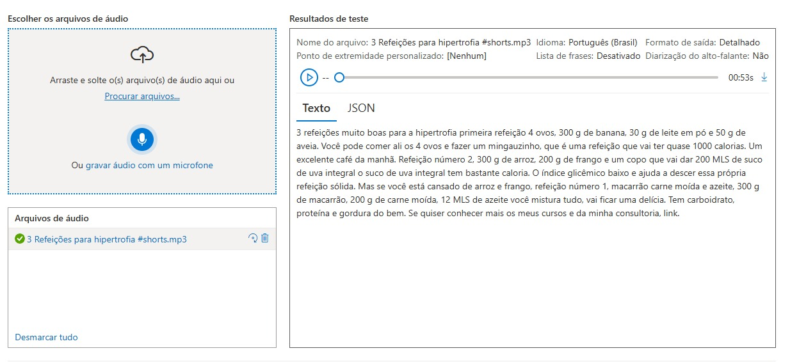

# Laboratório Azure AI
## Atividade prática 1
### 📝 Passos Realizados
1. Fiz o upload de um áudio no **Speech Studio**.
2. O serviço converteu o arquivo `.mp3` em texto automaticamente.
3. Analisei o texto gerado e suas possíveis aplicações.

### 📊 Insights e Possibilidades
- O reconhecimento de voz foi bastante preciso, conseguindo identificar números e medidas corretamente.
- Pode ser útil para transcrição de conteúdos educacionais ou criação de legendas automáticas para vídeos em redes sociais, por exemplo.
- Possibilidade de melhorar ainda mais a precisão ajustando o modelo com treinamentos personalizados.

### 📸 Prints do Processo
#### **Conversão de fala em texto em tempo real**

## 🚀 Possíveis Aplicações
- Criação automática de legendas para vídeos.
- Geração de resumos de palestras e reuniões.
- Automação de assistentes virtuais.
